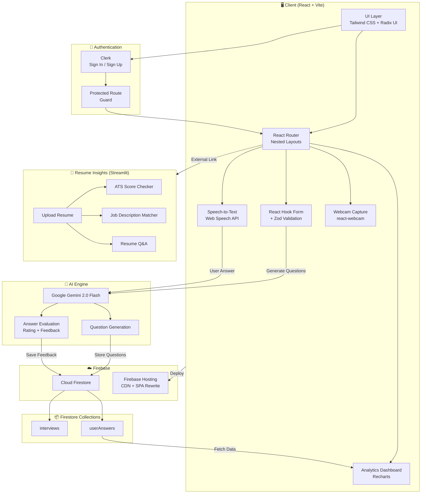
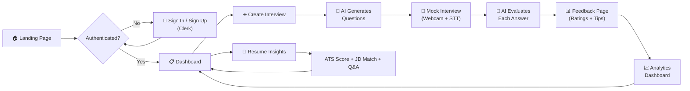

<div align="center">

# 🎯 AI Mock Interview Platform

**Ace your next interview with AI-powered practice sessions, real-time feedback, and detailed performance analytics.**

[](https://react.dev/)
[](https://www.typescriptlang.org/)
[](https://vitejs.dev/)
[](https://firebase.google.com/)
[](https://ai.google.dev/)
[](LICENSE)
[](https://ai-mock-interview-1a75a.web.app)

---

[Features](#-features) · [Quick Start](#-quick-start) · [Architecture](#-architecture) · [Usage](#-usage) · [Contributing](#-contributing) · [Roadmap](#-future-roadmap)

</div>

---

## 📖 Project Overview

**AI Mock Interview** is a cutting-edge web application that simulates real-world job interviews using Google's Gemini 2.0 Flash AI. Users can generate role-specific questions, practice with webcam and microphone, receive instant AI-powered feedback with ratings, and track their growth over time through a rich analytics dashboard.

### Why AI Mock Interview?

| Problem | Solution |
|---|---|
| Interview anxiety from lack of practice | Unlimited AI-generated mock sessions |
| No feedback on spoken answers | Real-time speech-to-text + AI evaluation |
| Difficulty tracking improvement | Visual analytics with charts & trend tracking |
| Generic question banks | Role, tech-stack, and experience-specific questions |

---

## ✨ Features

- **🤖 AI-Powered Question Generation** — Gemini 2.0 Flash creates tailored questions based on position, tech stack, and experience level
- **🎤 Speech-to-Text Recording** — Speak your answers naturally; they're transcribed and analyzed in real time
- **📹 Webcam Integration** — Practice with video to simulate a real interview environment
- **📊 Performance Analytics** — Interactive charts (line, bar, radar), stat cards, tag clouds, and trend analysis
- **🎯 Instant AI Feedback** — Get a 1–10 rating and actionable improvement suggestions for every answer
- **📄 Resume Insights** — AI-powered resume analysis with ATS compatibility scoring, job description matching, Q&A on your resume, and keyword optimization ([Launch App](https://resumeinsight-5441.streamlit.app/))
- **🔐 Secure Authentication** — Clerk-powered sign-up/sign-in with protected route guards
- **🌙 Dark / Light Mode** — Full theme toggle with `next-themes` integration
- **📱 Fully Responsive** — Optimized for desktop, tablet, and mobile devices
- **🚀 Firebase Hosting** — One-click deployment with SPA rewrite support
- **🎨 Premium UI** — Glassmorphism, particle backgrounds, scroll-reveal animations, and smooth micro-interactions

---

## 🛠️ Tech Stack

### Frontend

| Technology | Version | Purpose |
|---|---|---|
| [React](https://react.dev/) | 19.1 | UI library with latest concurrent features |
| [TypeScript](https://www.typescriptlang.org/) | 5.8 | Type-safe development |
| [Vite](https://vitejs.dev/) | 7.0 | Lightning-fast dev server & bundler |
| [Tailwind CSS](https://tailwindcss.com/) | 3.4 | Utility-first CSS framework |
| [Radix UI](https://www.radix-ui.com/) | Latest | Accessible, unstyled component primitives |
| [Recharts](https://recharts.org/) | 3.7 | Composable charting library |
| [Lucide React](https://lucide.dev/) | Latest | Beautiful, consistent icon set |

### Backend & Services

| Service | Purpose |
|---|---|
| [Firebase Firestore](https://firebase.google.com/docs/firestore) | NoSQL database for interviews, answers & analytics |
| [Google Generative AI (Gemini 2.0 Flash)](https://ai.google.dev/) | AI question generation & answer evaluation |
| [Clerk](https://clerk.com/) | Authentication, user management & protected routes |
| [Firebase Hosting](https://firebase.google.com/docs/hosting) | SPA deployment with CDN distribution |
| [Resume Insights (Streamlit)](https://resumeinsight-5441.streamlit.app/) | External AI-powered resume analysis & ATS checking |

### Key Libraries

| Library | Purpose |
|---|---|
| `react-router-dom` | Client-side routing with nested layouts |
| `react-hook-form` + `zod` | Form handling with schema validation |
| `react-hook-speech-to-text` | Browser speech recognition integration |
| `react-webcam` | Webcam capture for video simulation |
| `sonner` | Elegant toast notifications |
| `react-fast-marquee` | Animated marquee components |
| `next-themes` | Dark / light theme toggling |

---

## 🚀 Quick Start

### Prerequisites

| Requirement | Minimum Version |
|---|---|
| Node.js | v18+ |
| pnpm (recommended) or npm | Latest |
| Firebase Project | With Firestore enabled |
| Google AI API Key | Gemini API access |
| Clerk Account | Publishable key |

### 1 · Clone the Repository

```bash
git clone https://github.com/yourusername/Ai-Mock-Interview.git
cd Ai-Mock-Interview
```

### 2 · Install Dependencies

```bash
# Using pnpm (recommended)
pnpm install

# Or using npm
npm install
```

### 3 · Configure Environment Variables

Create a `.env` file in the project root:

```env
# Firebase Configuration
VITE_FIREBASE_API_KEY=your_firebase_api_key
VITE_FIREBASE_AUTH_DOMAIN=your_project.firebaseapp.com
VITE_FIREBASE_PROJECT_ID=your_project_id
VITE_FIREBASE_STORAGE_BUCKET=your_project.appspot.com
VITE_FIREBASE_MESSAGING_SENDER_ID=your_sender_id
VITE_FIREBASE_APP_ID=your_app_id

# Google Gemini AI
VITE_GEMINI_API_KEY=your_gemini_api_key

# Clerk Authentication
VITE_CLERK_PUBLISHABLE_KEY=your_clerk_publishable_key
```

### 4 · Start the Development Server

```bash
pnpm dev
# or
npm run dev
```

Open your browser at **[http://localhost:5173](http://localhost:5173)**.

### 5 · Build for Production

```bash
pnpm build
pnpm preview   # Preview the production build locally
```

---

## 🔧 Available Scripts

| Command | Description |
|---|---|
| `pnpm dev` | Start the Vite development server with HMR |
| `pnpm build` | Type-check with `tsc` and build for production |
| `pnpm preview` | Preview the production build locally |
| `pnpm lint` | Run ESLint across the project |

---

## 🏗️ Architecture

### System Architecture Diagram



### Application Flow



---

## 📄 Resume Insights

The platform integrates an **AI-powered Resume Insights** tool — a companion Streamlit application accessible directly from the navigation bar.

🔗 **Live App:** [https://resumeinsight-5441.streamlit.app](https://resumeinsight-5441.streamlit.app/)

### What It Does

| Feature | Description |
|---|---|
| **Resume Q&A** | Ask any question about your resume — the AI reads and answers based on your uploaded document |
| **ATS Compatibility Score** | Get an instant ATS (Applicant Tracking System) readability score with actionable improvement tips |
| **Job Description Matching** | Paste a job description and compare it against your resume to see how well you match |
| **Keyword Optimization** | Identifies missing keywords and suggests additions to increase your callback rate |
| **Structural Analysis** | Evaluates formatting, section ordering, and content quality for recruiter readability |

### How to Use

```
1. Click "Resume Insights" in the navigation bar (requires sign-in)
2. Upload your resume (PDF format)
3. Choose an analysis mode:
   • ATS Score Check  → Get your ATS compatibility rating
   • Job Description Match → Paste a JD to compare against your resume
   • Ask a Question → Query anything about your resume content
4. Review AI-generated insights and recommendations
5. Iterate on your resume and re-upload for improved scores
```

---

## 📁 Project Structure

```
Ai-Mock-Interview/
├── public/                     # Static assets
├── src/
│   ├── components/             # Reusable UI components
│   │   ├── ui/                 # Shadcn-style base components (Button, Input, etc.)
│   │   ├── header.tsx          # App navigation header
│   │   ├── footer.tsx          # App footer
│   │   ├── form-mock-interview.tsx  # Interview creation form
│   │   ├── record-answer.tsx   # Webcam + STT answer recording
│   │   ├── question-section.tsx # Question display panel
│   │   ├── pin.tsx             # Interview card/pin component
│   │   └── ...                 # Other shared components
│   ├── config/
│   │   └── firebase.config.ts  # Firebase initialization
│   ├── handlers/
│   │   └── auth-handler.tsx    # Authentication route handler
│   ├── hooks/
│   │   └── useAnalytics.ts     # Analytics data fetching hook
│   ├── layouts/
│   │   ├── auth-layout.tsx     # Authentication pages layout
│   │   ├── main-layout.tsx     # Authenticated main layout
│   │   ├── protected-layout.tsx # Route protection wrapper
│   │   └── public-layout.tsx   # Public pages layout
│   ├── lib/
│   │   ├── helper.ts           # Route definitions & helpers
│   │   └── utils.ts            # Utility functions (cn, etc.)
│   ├── provider/               # Context providers (theme, etc.)
│   ├── routes/
│   │   ├── home.tsx            # Landing page
│   │   ├── about.tsx           # About page
│   │   ├── services.tsx        # Services page
│   │   ├── contact.tsx         # Contact page
│   │   ├── dashboard.tsx       # User dashboard
│   │   ├── create-edit-page.tsx # Create/edit interview
│   │   ├── mock-load-page.tsx  # Interview loading/preparation
│   │   ├── mock-interview-page.tsx # Live interview session
│   │   ├── feedback.tsx        # Post-interview feedback
│   │   ├── analytics.tsx       # Analytics dashboard
│   │   ├── sign-in.tsx         # Sign-in page
│   │   └── sign-up.tsx         # Sign-up page
│   ├── scripts/
│   │   └── index.ts            # Gemini AI chat session setup
│   ├── types/                  # TypeScript type definitions
│   ├── App.tsx                 # Root component with routing
│   ├── main.tsx                # App entry point
│   └── index.css               # Global styles & Tailwind base
├── .env                        # Environment variables (not committed)
├── firebase.json               # Firebase Hosting config
├── tailwind.config.js          # Tailwind CSS configuration
├── vite.config.ts              # Vite bundler configuration
├── tsconfig.json               # TypeScript configuration
└── package.json                # Dependencies & scripts
```

---

## 🎯 Usage

### Creating a Mock Interview

```
1. Sign in with your account
2. Click "Create New Interview" on the Dashboard
3. Fill in the interview details:
```

```typescript
// The form validates these fields with Zod:
{
  position: "Senior Frontend Developer",   // Job title (required)
  description: "React-based web apps...",  // Role description (min 10 chars)
  experience: 3,                           // Years of experience (≥ 0)
  techStack: "React, TypeScript, Node.js"  // Technologies (required)
}
```

```
4. Click "Generate" — Gemini AI creates tailored interview questions
5. Start the mock interview with webcam & microphone
6. Speak your answers — they're transcribed in real time
7. Receive instant AI feedback with a 1–10 rating per answer
8. View your detailed feedback and analytics dashboard
```

### Example: AI-Generated Question Flow

```
┌─────────────────────────────────────────┐
│  📝 Interview Setup                     │
│                                         │
│  Position : Full-Stack Developer        │
│  Stack    : React, Node.js, MongoDB     │
│  Exp      : 2 years                     │
└──────────────┬──────────────────────────┘
               │
               ▼
┌─────────────────────────────────────────┐
│  🤖 Gemini 2.0 Flash generates 5       │
│     role-specific questions             │
└──────────────┬──────────────────────────┘
               │
               ▼
┌─────────────────────────────────────────┐
│  🎤 You answer via webcam + mic         │
│  📝 Speech-to-text transcription        │
└──────────────┬──────────────────────────┘
               │
               ▼
┌─────────────────────────────────────────┐
│  📊 AI Feedback                         │
│  Rating   : 8/10                        │
│  Feedback : "Great explanation of       │
│              React hooks. Consider      │
│              mentioning performance     │
│              optimization strategies."  │
└─────────────────────────────────────────┘
```

---

## 📊 Feature Comparison

### Supported Capabilities

| Feature | Status | Description |
|---|:---:|---|
| AI Question Generation | ✅ | Gemini 2.0 Flash generates role-specific questions |
| Speech-to-Text | ✅ | Web Speech API with real-time transcription |
| Webcam Recording | ✅ | Live video feed during interview practice |
| AI Answer Evaluation | ✅ | Instant feedback with 1–10 rating scale |
| Performance Analytics | ✅ | Line, bar charts + tag clouds via Recharts |
| Resume ATS Score Check | ✅ | AI-powered ATS compatibility analysis |
| Resume Q&A | ✅ | Ask questions about your uploaded resume |
| Job Description Matching | ✅ | Compare resume against any job posting |
| Keyword Optimization | ✅ | AI identifies missing resume keywords |
| Dark / Light Mode | ✅ | Theme toggle with system preference support |
| Responsive Design | ✅ | Mobile, tablet, and desktop optimized |
| Firebase Hosting | ✅ | Deployed with SPA rewrites |
| Multi-language Support | 🔜 | Planned for future release |
| Video Playback Review | 🔜 | Planned for future release |
| Resume-based Interview Questions | 🔜 | Generate interview questions from your resume |

### Browser Compatibility

| Browser | Supported | Notes |
|---|:---:|---|
| Chrome | ✅ | Full support (recommended) |
| Firefox | ✅ | Speech API may vary |
| Edge | ✅ | Full support |
| Safari | ⚠️ | Limited Speech-to-Text support |
| Mobile Chrome | ✅ | Responsive + camera access |
| Mobile Safari | ⚠️ | Limited webcam/STT support |

---

## ⚙️ Configuration Options

### Environment Variables

| Variable | Required | Default | Description |
|---|:---:|---|---|
| `VITE_FIREBASE_API_KEY` | ✅ | — | Firebase project API key |
| `VITE_FIREBASE_AUTH_DOMAIN` | ✅ | — | Firebase authentication domain |
| `VITE_FIREBASE_PROJECT_ID` | ✅ | — | Firebase project identifier |
| `VITE_FIREBASE_STORAGE_BUCKET` | ✅ | — | Firebase Cloud Storage bucket |
| `VITE_FIREBASE_MESSAGING_SENDER_ID` | ✅ | — | Firebase Cloud Messaging sender ID |
| `VITE_FIREBASE_APP_ID` | ✅ | — | Firebase application ID |
| `VITE_GEMINI_API_KEY` | ✅ | — | Google Gemini API key |
| `VITE_CLERK_PUBLISHABLE_KEY` | ✅ | — | Clerk publishable key for auth |

### Gemini AI Configuration

| Parameter | Value | Description |
|---|---|---|
| `model` | `gemini-2.0-flash` | Fast, efficient model for real-time Q&A |
| `temperature` | `1` | Controls response randomness (0–2) |
| `topP` | `0.95` | Nucleus sampling threshold |
| `topK` | `40` | Top-K sampling limit |
| `maxOutputTokens` | `8192` | Maximum response length |
| `responseMimeType` | `text/plain` | Output format |

### Safety Settings

| Category | Threshold |
|---|---|
| Harassment | `BLOCK_MEDIUM_AND_ABOVE` |
| Hate Speech | `BLOCK_MEDIUM_AND_ABOVE` |
| Sexually Explicit | `BLOCK_MEDIUM_AND_ABOVE` |
| Dangerous Content | `BLOCK_MEDIUM_AND_ABOVE` |

---

## 🚀 Deployment

### Firebase Hosting (Current)

The app is deployed at: **[https://ai-mock-interview-1a75a.web.app](https://ai-mock-interview-1a75a.web.app)**

```bash
# Build the production bundle
pnpm build

# Deploy to Firebase Hosting
firebase deploy --only hosting
```

### Alternative Platforms

```bash
# Vercel
npx vercel --prod

# Netlify
npx netlify deploy --prod --dir=dist
```

> **Note:** Remember to configure all environment variables in your hosting platform's dashboard.

---

## 🤝 Contributing

Contributions are welcome! Please follow these guidelines:

### Getting Started

1. **Fork** the repository
2. **Clone** your fork locally
3. **Create** a feature branch:
   ```bash
   git checkout -b feature/your-feature-name
   ```
4. **Install** dependencies:
   ```bash
   pnpm install
   ```

### Coding Standards

- **TypeScript** — All new code must be written in TypeScript with proper types
- **Components** — Use functional components with hooks
- **Naming** — Use `PascalCase` for components, `camelCase` for functions/variables
- **Styling** — Use Tailwind CSS utility classes; avoid inline styles
- **Forms** — Use `react-hook-form` with `zod` schemas for validation
- **Linting** — Run `pnpm lint` and fix all errors before committing

### Pull Request Process

1. Ensure your branch is up to date with `main`
2. Run linting and fix any issues:
   ```bash
   pnpm lint
   ```
3. Build successfully:
   ```bash
   pnpm build
   ```
4. Write a clear, descriptive PR title and description
5. Reference any related issues using `Fixes #issue-number`

### Issue Reporting

- Use the [GitHub Issues](https://github.com/anant5441/Ai-Mock-Interview/issues) tab
- Include steps to reproduce, expected behavior, and actual behavior
- Attach screenshots or browser console logs when applicable
- Label issues appropriately (`bug`, `enhancement`, `documentation`)

---

## 📄 License

This project is licensed under the **MIT License**.

```
MIT License

Copyright (c) 2025 AI Mock Interview

```

---

## 🔮 Future Roadmap

- [ ] **Resume-Based Question Generation** — Generate interview questions directly from uploaded resume content
- [ ] **Multi-language Interview Support** — Practice in languages beyond English
- [ ] **Video Playback & Review** — Record and replay interview sessions with annotations
- [ ] **Peer-to-Peer Mock Interviews** — Real-time interview practice with other users
- [ ] **Interview Templates Library** — Pre-built templates for FAANG, startups, freelancing, etc.
- [ ] **Advanced Analytics** — Comparative benchmarking against anonymized peer data
- [ ] **Mobile App (React Native)** — Native mobile experience for on-the-go practice
- [ ] **AI Body Language Analysis** — Webcam-based posture, eye-contact, and gesture feedback
- [ ] **Export Reports** — Download PDF/CSV reports of interview performance history
- [ ] **Integration with Job Boards** — Connect with LinkedIn, Indeed for role-specific prep
- [ ] **Custom Question Banks** — Let users create and share curated question sets
- [ ] **Timed Interview Mode** — Simulate time-boxed real interview conditions
- [ ] **Resume Cover Letter Generator** — Auto-generate tailored cover letters from resume + JD

---

## 🙏 Acknowledgments

- [Google Generative AI](https://ai.google.dev/) — Powering intelligent question generation & evaluation
- [Clerk](https://clerk.com/) — Seamless authentication experience
- [Firebase](https://firebase.google.com/) — Reliable database and hosting infrastructure
- [React](https://react.dev/) — The foundation of the user interface
- [Tailwind CSS](https://tailwindcss.com/) — Rapid, utility-first styling
- [Radix UI](https://www.radix-ui.com/) — Accessible component primitives
- [Recharts](https://recharts.org/) — Beautiful, composable charts

---

<div align="center">

**Built with ❤️ using modern web technologies**

[⬆ Back to Top](#-ai-mock-interview-platform)

</div>
